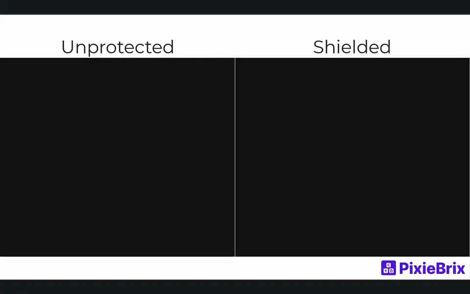
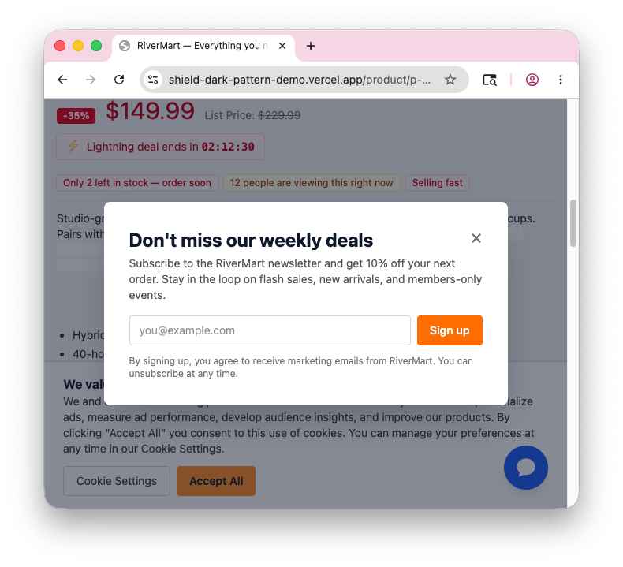
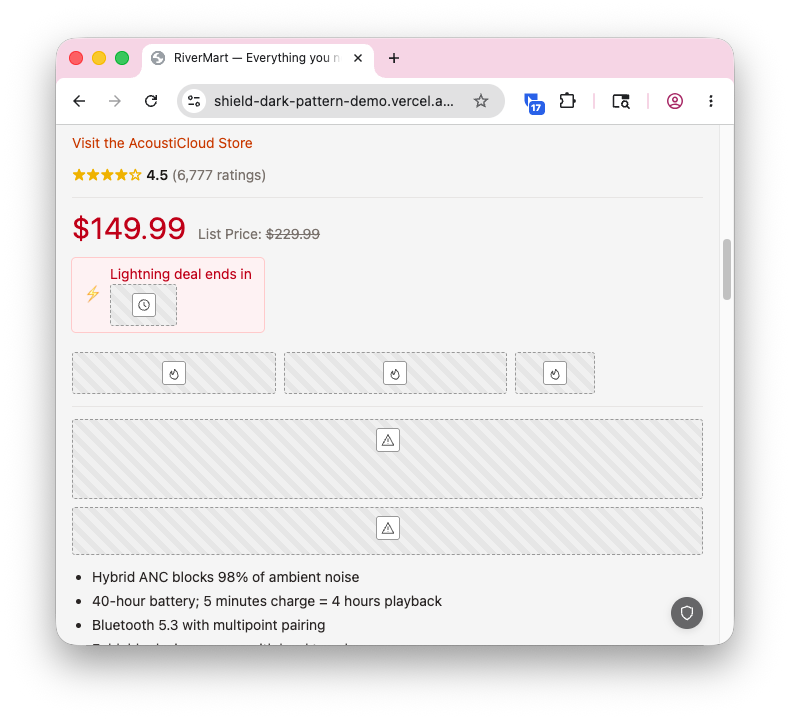

# agent-browser-shield

[](https://github.com/pixiebrix/agent-browser-shield/actions/workflows/ci.yml)
[](https://github.com/pixiebrix/agent-browser-shield/releases/latest)
[](https://chromewebstore.google.com/detail/agent-browser-shield/gnejacdioaelglahihpagpfjpddpnamd)
[](./LICENSE)

> **Alpha prototype:** rulesets may change without notice

Agent Browser Shield is a Chromium extension for making agentic browser-use more
effective and secure:

- **Token efficiency:** strip page chrome (footers, cookie banners, chat
  widgets, sponsored content) so agents spend tokens on the user's task.
- **Security & compliance:** mask PII and credentials before they reach the
  model, and suppress hidden text, HTML comments, and user-generated content
  that could carry prompt-injection payloads.
- **Accuracy:** block manipulative dark patterns and hide engagement rails and
  other content that could distract the model from the user's task.

**[Install from the Chrome Web Store](https://chromewebstore.google.com/detail/agent-browser-shield/gnejacdioaelglahihpagpfjpddpnamd)**
— works on any Chromium-based browser (Chrome, Edge, Brave, Arc, Opera). For
agent runtimes that need an unpacked extension or a ZIP, see the
[install guide](https://pixiebrix.github.io/agent-browser-shield/install/).

**[Documentation](https://pixiebrix.github.io/agent-browser-shield/)** — install
guide, rule reference, and configuration.

**[Live demo site](https://shield-dark-pattern-demo.vercel.app/)** — RiverMart,
a mock e-commerce SPA that exercises every rule. Load it with and without the
extension to see the before/after difference.

**[ClawHub skill](https://clawhub.ai/pixiebrix/agent-browser-shield)** — for
skill-aware [OpenClaw](https://openclaw.ai) agents, install with
`clawhub install agent-browser-shield` to load the install paths and runtime
behavior contract.



| Before                                              | After                                             |
| --------------------------------------------------- | ------------------------------------------------- |
|  |  |

## Prerequisites

- **Node** ≥ 24 and **Bun** ≥ 1.3 — extension and demo site
- **uv** — runs the Python scripts (each declares its own PEP 723 deps; the repo
  pins Python 3.14 via `.python-version`, but scripts work on 3.11+)
- **Chrome / Chromium 148+** — to load the unpacked extension

## Repository layout

| Path         | What's there                                                       |
| ------------ | ------------------------------------------------------------------ |
| `extension/` | Chromium MV3 extension (Bun + TypeScript)                          |
| `demo-site/` | Vite/React mock e-commerce site that exercises every rule          |
| `docs/`      | Astro Starlight docs site                                          |
| `benchmark/` | Tasks, scenarios, and pricing for the agent benchmark harness      |
| `scripts/`   | PEP 723 scripts: agent task runner, benchmark harness, trace tools |
| `skills/`    | Claude Code skills for installing, configuring, and diagnosing     |

## Extension

The Chromium MV3 extension lives in [`extension/`](./extension). Build output
goes to `extension/dist/`, which is what you load as an unpacked extension at
`chrome://extensions`.

### Build

```sh
cd extension
bun install
bun run build
```

### Customize build-time defaults

Which rules ship on by default is enumerated in
[`extension/src/rules/rule-metadata.ts`](./extension/src/rules/rule-metadata.ts).
To ship a build with a custom set without forking the repo, pass an override
file to `bun run build`. The file is a flat JSON object whose keys are rule ids
(same keys the Options-page export uses) plus a small set of reserved non-rule
keys:

- `optionsButton` (boolean, default off) — floating on-page button that opens
  the options page.
- `runOnInactiveTabs` (boolean, default off) — keep observing while the tab is
  hidden.
- `debugTrace` (boolean, default off) — start with the dev-mode trace recorder
  enabled so the popup's **Export** button can dump a JSONL trace without a
  human flipping the toggle. Intended for automation builds (CDP, Browserbase).
  The export shape is documented in
  [`extension/data/debug-trace.schema.json`](./extension/data/debug-trace.schema.json).

See
[`extension/data/defaults-overrides.example.json`](./extension/data/defaults-overrides.example.json)
for a starting template:

```sh
bun run build --defaults ./my-defaults.json
# or:
EXTENSION_DEFAULTS_FILE=./my-defaults.json bun run build
```

Overrides only apply to fresh `chrome.storage`; users with toggled state keep
their preferences. See
[the install guide](https://agent-browser-shield.pixiebrix.com/install/#customizing-defaults-at-build-time)
for details.

### Watch for changes

`bun run watch` rebuilds `extension/dist/` whenever a file in `extension/src/`
changes:

```sh
cd extension
bun run watch
```

After each rebuild, click the reload icon for the extension at
`chrome://extensions` (or use a tool like
[Extensions Reloader](https://chromewebstore.google.com/detail/extensions-reloader))
and refresh any open tabs to pick up the new content script.

### Tests

Rule unit tests run under [Jest](https://jestjs.io) against a
[jsdom](https://github.com/jsdom/jsdom) DOM. They live alongside the source in
`extension/src/rules/__tests__/`.

```sh
cd extension
bun install
bun run test
```

Filter to a single suite with the standard Jest CLI, e.g.
`bun run test -- pii-redact`.

### Refresh EasyList snapshot

The `ads-hide` rule bundles a snapshot of EasyList's generic element-hiding
selectors (`extension/src/rules/easylist-generic.generated.ts`, ~13k selectors).
Refresh it when ad-network selectors drift:

```sh
cd extension
bun run fetch-easylist   # alias for `uv run scripts/fetch_easylist.py`
```

The generated file is committed to keep builds deterministic and
offline-capable; pre-commit hooks and Biome skip `*.generated.*` files.

### Package for Browserbase

Bundle `extension/dist/` into a ZIP suitable for uploading via the
[Browserbase extensions API](https://docs.browserbase.com/platform/browser/core-features/browser-extensions#browser-extensions):

```sh
cd extension
bun run build
bun run package           # writes output/agent-browser-shield-extension.zip at the repo root
# or specify an output path / directory:
bun run package -- ~/Downloads/agent-browser-shield.zip
```

The `output/` directory is gitignored.

## Demo site

[`demo-site/`](./demo-site) is a Vite/React mock e-commerce SPA ("RiverMart")
that deliberately packs the threats and dark patterns agent-browser-shield
defends against onto a few pages. Load it with and without the extension to see
the before/after difference.

Live deployment: <https://shield-dark-pattern-demo.vercel.app/>

To run it locally instead:

```sh
cd demo-site
bun install
bun run dev          # http://localhost:5173
```

See [`demo-site/README.md`](./demo-site/README.md) for the per-page rule
coverage and Vercel deploy instructions.

## Agent task

[`scripts/agent_task.py`](./scripts/agent_task.py) runs a
[Browserbase agent task](https://docs.browserbase.com/use-cases/agents) via the
Stagehand Python SDK. The script declares its dependencies inline (PEP 723), so
`uv` will fetch them on first run.

Copy [`env.sample`](./env.sample) to `.env` and fill in the API keys, then:

```sh
# Without the extension
uv run scripts/agent_task.py --instruction "Find the top story on HN"

# With the agent-browser-shield extension uploaded and loaded into the session
# (requires running the packaging script above first)
uv run scripts/agent_task.py --with-extension \
    --instruction "Find the top story on HN"
```

## Benchmark harness

[`scripts/benchmark_run.py`](./scripts/benchmark_run.py) compares agent
performance across configurations (extension on/off, model vendor/size, step
budget) over a fixed task set, judges each result inline, and writes a run
bundle under `output/results/<run_id>/`.
[`scripts/benchmark_report.py`](./scripts/benchmark_report.py) renders an HTML
matrix with per-task side-by-side scenario diffs and a11y-tree comparisons.

```sh
# 1. Build + package the extension (only for scenarios with extension: true)
cd extension && bun run build && bun run package && cd ..

# 2. Run the benchmark
uv run scripts/benchmark_run.py \
    --scenarios benchmark/scenarios.example.yaml \
    --tasks benchmark/tasks.csv \
    --concurrency 25 -n 3

# 3. Render the report
uv run scripts/benchmark_report.py --run-id <run_id> --open

# 4. Resume / repair an incomplete run (idempotent)
uv run scripts/benchmark_resume.py --run-id <run_id>
```

Old run artifacts under `output/results/` and `output/reports/` are gitignored;
prune them with `uv run scripts/clean_artifacts.py` (dry-run by default). See
[`benchmark/README.md`](./benchmark/README.md) for the full workflow, BU Bench
V1 fetch, and trace-bundle diagnostics.

## Skills

[`skills/`](./skills) holds Claude Code skills for installing, configuring,
running tasks against, and diagnosing the extension. See each skill's `SKILL.md`
for invocation details.

## Contributing

See [CONTRIBUTING.md](./CONTRIBUTING.md) for setup, expectations, and the
contributor-license-agreement workflow. New rules are a great place to start —
`extension/src/rules/scarcity-redact.ts` is a small worked example.

## License

`agent-browser-shield` is **source-available** under
[PolyForm Shield 1.0.0](./LICENSE). Use it commercially, internally, or for
research at no cost — the only restriction is that you can't use it to build a
product that competes with `agent-browser-shield` or with a PixieBrix product
built on it. See [LICENSING.md](./LICENSING.md) for details and how to obtain a
commercial license if you need one.

## Security

Please report vulnerabilities privately via GitHub's
["Report a vulnerability"](https://github.com/pixiebrix/agent-browser-shield/security/advisories/new)
form. Do **not** open a public issue for security problems.

## Privacy

The extension does not collect, store, or send any telemetry, analytics, or
usage data. Rule processing runs locally in your browser; nothing is reported
back to PixieBrix or any other server.

The one outbound network call the extension can make is the optional
`irrelevant-sections-redact` rule (off by default), which sends a compressed
page tree to OpenAI's API for classification when you enable the rule and
configure an API key.

## Disclaimer

`agent-browser-shield` reduces the threats a browser-use agent faces on a page,
but it can't catch everything. Take precautions when using AI agents for browser
use. The extension is provided **as-is, without warranty of any kind** — see
[LICENSE](./LICENSE) for the full terms.
